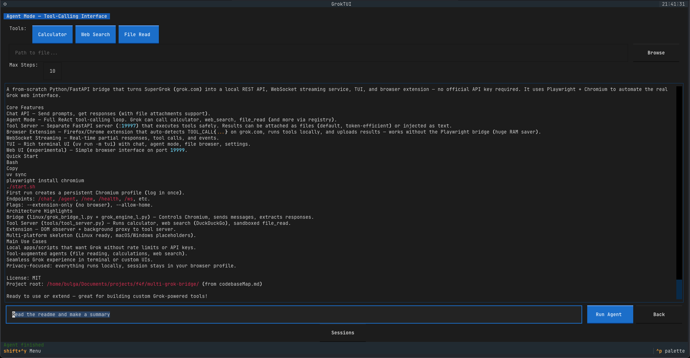

# multi-grok-bridge

Turn **SuperGrok** into a REST API + WebSocket service + TUI. No API key needed.
Uses Playwright + Chromium to automate grok.com in the browser.

> Originally inspired by [grok-bridge v3.0](https://github.com/anthropics/grok-bridge) — this is a complete from-scratch rewrite with a different architecture (Python/FastAPI, Playwright Chromium, Linux, tool-calling agent, WebSocket streaming, TUI).

## Quick Start

```bash
# Install dependencies
uv sync
playwright install chromium

# Start the bridge (headed mode by default)
uv run linux/grok_bridge_l.py --port 19998

# In another terminal — send a message
curl -X POST http://localhost:19998/chat \
  -H "Content-Type: application/json" \
  -d '{"prompt": "What is the mass of the sun?", "timeout": 60}'

# Start a new conversation
curl -X POST http://localhost:19998/new

# Health check
curl http://localhost:19998/health

# Read current conversation
curl http://localhost:19998/history
```

On first run, a persistent Chromium profile is created. Log into grok.com once, subsequent requests reuse the session.

### File attachments

```bash
curl -X POST http://localhost:19998/chat \
  -H "Content-Type: application/json" \
  -d '{"prompt": "Summarize this file", "files": ["/path/to/file.txt"]}'
```

## Agent Mode (Tool Calling)

Grok can call tools during a conversation. Tools are executed by a separate tool server:

```bash
# Terminal 1: start the tool server
uv run python tools/tool_server.py --port 19997

# Terminal 2: start the bridge
uv run linux/grok_bridge_l.py --port 19998 --tool-server-url http://localhost:19997

# Send an agent prompt — Grok can invoke calculator, web_search, file_read
curl -X POST http://localhost:19998/agent \
  -H "Content-Type: application/json" \
  -d '{"prompt": "Search the web for AI news and calculate 2+2", "tools": ["web_search", "calculator"]}'
```

Available tools: `calculator`, `web_search`, `file_read`.

## WebSocket Streaming

For real-time streaming of Grok responses (partial output, tool calls, intermediate results):

```python
import json
from websockets.asyncio.client import connect

async def stream():
    async with connect("ws://localhost:19998/ws") as ws:
        await ws.send(json.dumps({"type": "prompt", "content": "Explain quantum computing", "mode": "chat"}))
        async for msg in ws:
            event = json.loads(msg)
            print(event["type"], event.get("content", ""))
            if event["type"] in ("done", "error", "timeout", "status"):
                break
```

Event types: `partial` (streaming text), `done` (final), `tool_call`, `tool_result`, `message`, `status`.

## TUI (Textual Terminal UI)

A full terminal user interface with chat, agent mode, settings, and file picker:



```bash
uv run -m tui
```

- **Main screen**: chat with Grok, file attachments, history
- **Agent screen**: toggle tool buttons, file browser for `file_read`, streaming agent output
- **Settings**: server URL, timeouts, WebSocket toggle
- **Ctrl+Shift+Y** or **Menu button**: open menu

Toggle WebSocket mode in Settings for real-time response streaming in the chat.

## Endpoints

| Method | Path | Description |
|--------|------|-------------|
| POST | `/chat` | Send prompt, wait for response |
| POST | `/agent` | Agent loop with tool calling |
| POST | `/new` | Start new conversation |
| GET | `/health` | Bridge health + Grok connection status |
| GET | `/history` | Current page conversation text |
| WS | `/ws` | WebSocket streaming (chat + agent) |

## Architecture

```
┌──────────────────┐     POST /chat        ┌─────────────────────────────┐
│  HTTP Client     │     POST /agent       │  Bridge (FastAPI)           │
│  (curl / code)   │ ─────────────────────→│                             │
│                  │     WS /ws            │  grok_bridge_l.py           │
│  WebSocket       │ ◄═══════════════════  │  grok_engine_l.py           │
│  Client          │    streaming events   │  ↓ Playwright + Chromium    │
└──────────────────┘                       │  ↓ grok.com                 │
                                           │                             │
┌──────────────────┐                       │  Agent loop:                │
│  TUI (Textual)   │ ── REST / WS ───────→│  send → TOOL_CALL → execute │
│  -tui/           │                       │  → send result → repeat    │
└──────────────────┘                       └──────────┬──────────────────┘
                                                      │ POST /tools/run
                                                      ▼
                                           ┌──────────────────────┐
                                           │  Tool Server         │
                                           │  tools/tool_server.py│
                                           │  calculator          │
                                           │  web_search          │
                                           │  file_read           │
                                           └──────────────────────┘
```

## Environment Variables

| Variable | Default | Description |
|----------|---------|-------------|
| `GROK_HOST` | 0.0.0.0 | Bind address |
| `GROK_PORT` | 19998 | Bind port |
| `GROK_PROFILE_DIR` | ~/.grok-bridge/firefox-profile | Chromium profile path |
| `GROK_HEADLESS` | 0 | Run browser headless (1=yes) |
| `GROK_PAGE_TIMEOUT` | 60 | Page/script timeout (seconds) |
| `TOOL_SERVER_URL` | http://localhost:19997 | Tool server for /agent |
| `GROK_PROJECT_URL` | — | Grok project URL for persistent instructions |

## License

MIT
